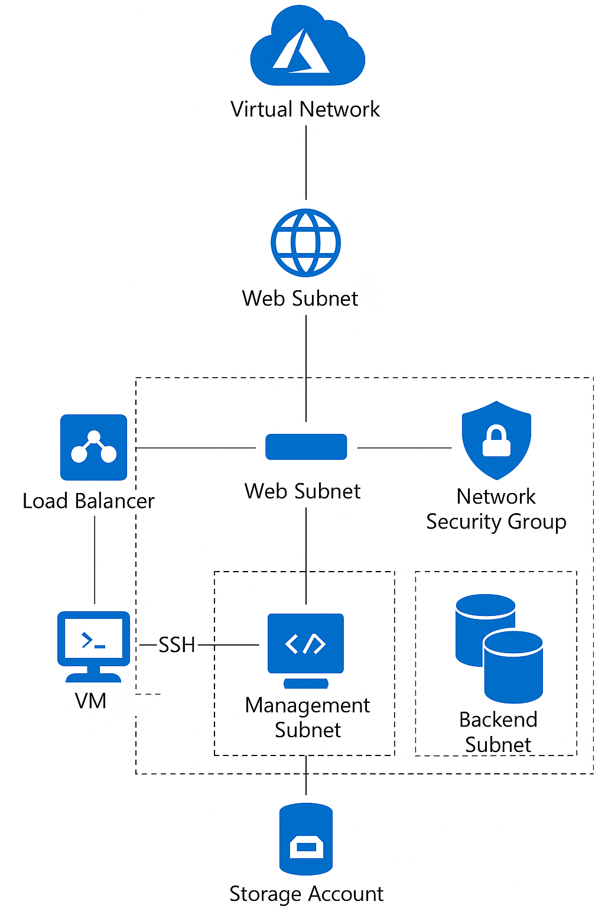

# 🌌 Coalfire Azure Technical Challenge  
**Author:** Matthew Morgan  

This repository showcases a Terraform proof-of-concept for deploying a secure, modular Azure environment that hosts a simple web application behind a public load balancer.  
It emphasizes Infrastructure-as-Code principles, network segmentation, and Azure security best practices — designed to be clean, reproducible, and scalable.

---

## Solution Overview  
This project builds out:

- A **VNet (10.0.0.0/16)** split into four subnets — web, app, backend, and management  
- **Two Ubuntu web VMs** in an **Availability Set**, each running Apache for easy validation  
- **One management VM** with SSH locked down to a single admin CIDR  
- An **Azure Load Balancer** distributing inbound HTTP traffic (port 80) to the web VMs  
- A **GRS-replicated storage account** with containers `terraformstate` and `weblogs`  
- **Per-subnet NSGs** enforcing least-privilege access:
  - Management → SSH to Web  
  - Load Balancer → HTTP to Web  
  - Internet → Denied by default  

> **Region:** West US 2 (chosen for stability and free-tier compatibility)

---

## Repository Layout
```
coalfire-azure-challenge/
├── modules/
│   ├── network/
│   ├── compute/
│   ├── storage/
│   └── loadbalancer/
├── envs/
│   └── dev/
│       ├── main.tf
│       ├── variables.tf
│       ├── outputs.tf
│       └── terraform.tfvars.example
├── docs/
│   ├── architecture-diagram.png
│   └── diagram-legend.txt
├── screenshots/
│   ├── ssh-mgmt.png
│   ├── apache-web0.png
│   ├── apache-web1.png
│   └── lb-browser.png
├── scripts/
│   └── install_apache.sh
├── .gitignore
└── README.md
```

---

## Security Overview  
Each subnet enforces explicit inbound rules for defense-in-depth:

- Web subnet: HTTP (80) only from Load Balancer  
- Web subnet: SSH (22) only from Management  
- Management subnet: SSH (22) only from Admin CIDR  
- All other inbound traffic is blocked by default  

**Storage Access:**  
The storage account only accepts traffic from the Management subnet via a `Microsoft.Storage` service endpoint.

---

## Deployment Guide  

### Prerequisites
- Terraform ≥ 1.6  
- Azure CLI (`az login`)  
- SSH key pair (`~/.ssh/id_rsa.pub` or `~/.ssh/id_ed25519.pub`)

### 1️⃣ Configure
```bash
cd envs/dev
cp terraform.tfvars.example terraform.tfvars
# Edit terraform.tfvars:
# location           = "westus2"
# allowed_admin_cidr = "<your_ip>/32"
# admin_ssh_pubkey   = "~/.ssh/id_rsa.pub"
```

### 2️⃣ Deploy
```bash
terraform init
terraform plan -out tfplan
terraform apply tfplan
```

### 3️⃣ Check Outputs
```bash
terraform output -raw management_vm_ip
terraform output -raw lb_public_ip
```

---

## Validation  

After deployment, validate connectivity and function:

**SSH into Management VM**
```bash
ssh -A azureuser@$(terraform output -raw management_vm_ip)
```
📸 Screenshot: `ssh-mgmt.png`

**From Management → Web VMs**
```bash
ssh azureuser@10.0.1.4 "hostname -I && systemctl is-active apache2"
ssh azureuser@10.0.1.5 "hostname -I && systemctl is-active apache2"
```
📸 Screenshots: `apache-web0.png`, `apache-web1.png`

**Load Balancer Test**
```bash
echo "http://$(terraform output -raw lb_public_ip)"
```
Open the link in a browser and refresh — requests should alternate between both web VMs.  
📸 Screenshot: `lb-browser.png`

---

## Architecture Diagram  
Below is the deployed Azure environment — subnets, traffic flow, and security layers.

<div align="center">
  
  <br/>
  <em>Figure 1 – Segmented Azure environment with Load Balancer, Web, App, Backend, and Management subnets.</em>
</div>

### Diagram Highlights
- Internet → Load Balancer → Web Subnet  
- Admin CIDR → Management Subnet → Web Subnet  
- Mgmt Subnet → Azure Storage (Service Endpoint)  
- NSGs per subnet for granular control  

---

## Design Notes  
- Region: West US 2 for availability and cost balance  
- Modular layout: network, compute, storage, load balancer  
- NSGs: least privilege and clearly documented  
- Apache installed via cloud-init for simple validation  
- Local state for demo; remote backend ready for production  
- B-series VMs for free-tier and cost efficiency  

> For this challenge, Apache kept validation simple and visible, but the same structure can support Nginx, container workloads, or app services.

---

## Cleanup  
```bash
terraform destroy
```

---

## 🧩 Challenges & Fixes (Notes)
- **Region capacity**: East US SKUs (B-series) unavailable for my subscription → switched to **West US 2**.  
- **Storage ACL**: Denied until I enabled **Microsoft.Storage** service endpoints on the **management** subnet.  
- **SSH access**: Web VMs initially missed my public key → injected via `az vm run-command` and verified hop SSH from mgmt.  
- **Load Balancer traffic**: Ensured NSG rule uses **AzureLoadBalancer** source (not “Internet”) for port 80 on the web subnet.  

---

## References  
- [Coalfire Public Terraform Azure Repositories](https://github.com/orgs/Coalfire-CF/repositories?q=visibility:public+terraform-azure)
- [Terraform AzureRM Provider](https://registry.terraform.io/providers/hashicorp/azurerm/latest/docs)  
- [Azure Load Balancer Overview](https://learn.microsoft.com/azure/load-balancer/load-balancer-overview)  
- [Network Security Groups](https://learn.microsoft.com/azure/virtual-network/network-security-groups-overview)  
- [Service Endpoints](https://learn.microsoft.com/azure/virtual-network/virtual-network-service-endpoints-overview)  
- [Cloud-Init on Ubuntu](https://cloudinit.readthedocs.io/en/latest/)  

---

## Future Enhancements  
- Azure Bastion for private management  
- HTTPS termination via Application Gateway + WAF  
- Private Endpoints for Storage  
- Remote Terraform state with locking  
- VM Scale Sets for autoscaling  
- Centralized logging and monitoring  

---

### ✅ Submission Checklist
- [x] Terraform configurations  
- [x] Architecture diagram  
- [x] Screenshots for validation  
- [x] Polished README  
- [x] Public GitHub repository  

---

*This challenge reinforced modular IaC design, secure network segmentation, and clarity in Terraform code.*  
🪐 *Forged in code. Secured by design.*
